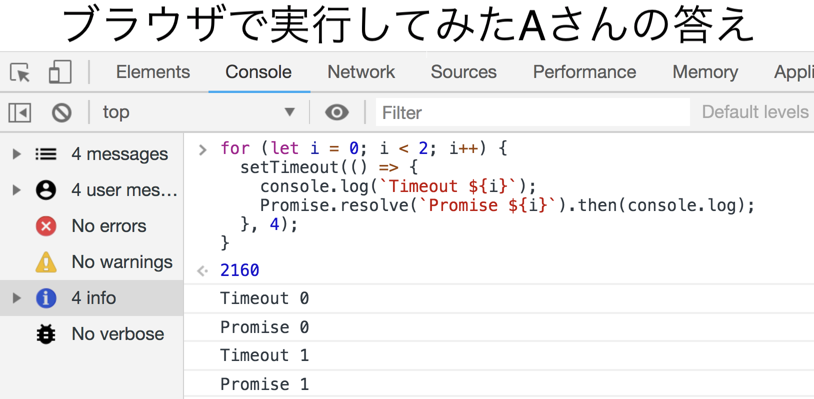
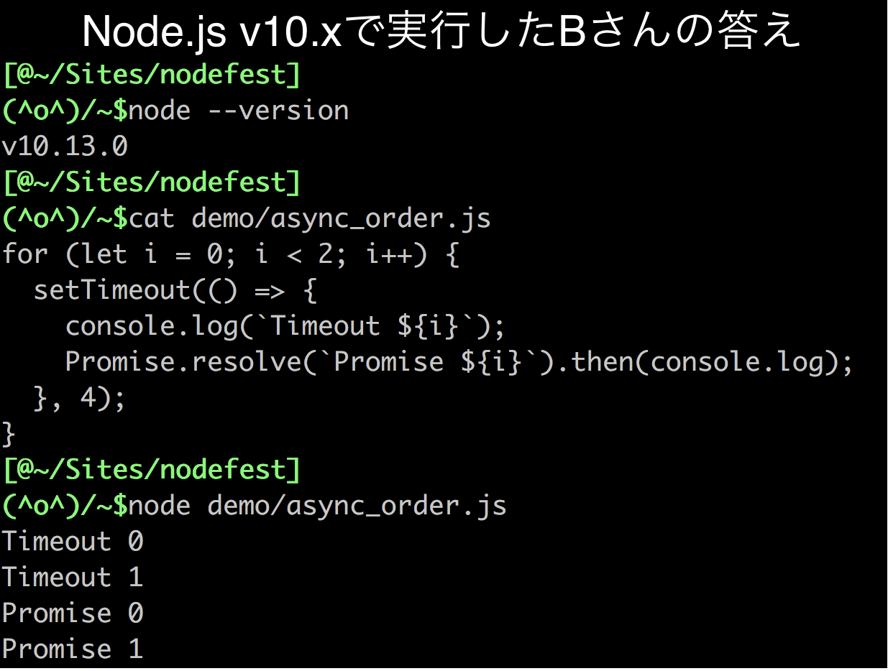
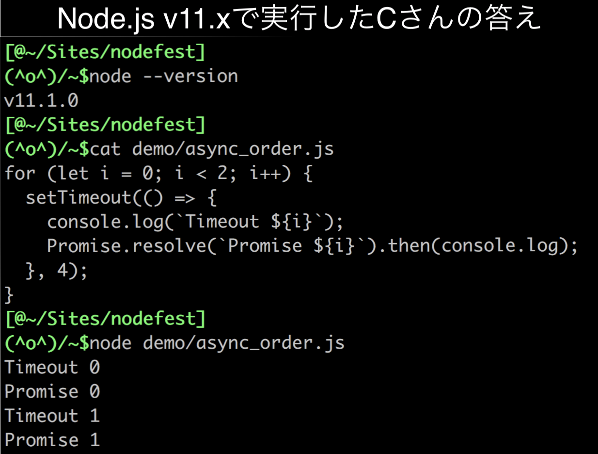

<!-- .slide: data-background="img/nodefest2018.png"-->
<!-- .slide: data-background-opacity="0.3"-->
## Diagnose your Node.js app

2018/11/23

by darai0512

<ul>
<li style="font-size: 32px">slide https://darai0512.github.io/nodefest2018/index.html#/</li>
<li style="font-size: 32px">twitter https://twitter.com/darai_0512</li>
</ul>

---

<!-- .slide: data-background="img/profile.jpeg""-->
<!-- .slide: data-background-opacity="0.5"-->
### console.table(me)

|(index)|Values|
|---|---|
|name|darai0512|
|company|Yahoo! JAPAN|
|work|広告向けデータ分析システム|
||社内言語サポート(Node.js)|
|side jobs|PAY株式会社|
||株式会社ミツモア|

Note:

言語サポートとして見てきたケースを話します

---

<!-- .slide: data-background="img/nodesummit2018.JPG"-->
<!-- .slide: data-background-opacity="0.5"-->
### Node.js初学者の悩み :thinking_face:

1. 非同期処理が難しい
  - APIの実行順が直感と違う...
  - エラーが再現しない...
1. エラーハンドリングが難しい
  - try-catch? Promise.catch? callbackや.on('error')?
1. debugが難しい
  - 非同期中に例外が起きた時、スタックトレースが途切れるんだけど...
  - 本番アプリが落ちた...どうdebugすればいい?

Note:
1.1

本スライドのモチベーションを述べる

ex, 昔(v0.10)よりmicroTaskQueueとか非同期パターンが多くて大変

---

<!-- .slide: data-background="img/figures/figures.001.jpeg"-->
<!-- .slide: data-background-size="30%"-->
<!-- .slide: data-background-repeat="space"-->
<!-- .slide: data-background-opacity="0.3"-->
### 非同期処理が難しい

ex1, 次の出力は? :thinking_face:

```js
for (let i = 0; i < 2; i++) {
  setTimeout(() => {
    console.log(`Timeout ${i}`);
    Promise.resolve(`Promise ${i}`).then(console.log);
  }, 4);
}
```

Note:
- ブラウザのdelayの最小値
  - DOM_MIN_TIMEOUT_VALUE
  - nested setTimeoutは4ms
  - https://developer.mozilla.org/ja/docs/Web/API/WindowTimers/setTimeout
  - https://html.spec.whatwg.org/multipage/timers-and-user-prompts.html#timers

---

<!-- .slide: data-background="img/browser_order.png"-->
<!-- .slide: data-background-size="contain"-->

Note:



---

<!-- .slide: data-background="img/nodejs_v10_order.png"-->
<!-- .slide: data-background-size="contain"-->

Note:



---

<!-- .slide: data-background="img/nodejs_v11_order.png"-->
<!-- .slide: data-background-size="contain"-->

Note:



---

<!-- .slide: data-background="img/figures/figures.001.jpeg"-->
<!-- .slide: data-background-size="30%"-->
<!-- .slide: data-background-repeat="space"-->
<!-- .slide: data-background-opacity="0.6"-->
#### 非同期処理の実行順は環境やバージョンで異なりうる

- PromiseとsetTimeout/setIntervalの実行順がNode.js v11.xから変わった
  - https://github.com/nodejs/node/pull/22842
  - semver-majorで各種ブラウザの挙動に合わせた
- **非同期APIの実行順の互換性は非保証**

Note:

TODO バックアップ資料で詳細解説

- 正確なissue: [#22257](https://github.com/nodejs/node/issues/22257)
  - Node.jsの非同期処理はJSエンジン(v8)とは異なり独自
- semver-major: APIの変更に互換性がないバージョンアップ
  - https://semver.org/lang/ja/
- queueMicroTask: Promise.resolve().then()の替わり(process.nextTick の終焉)
  - v11.x/docs/api/globals.html#globals_queuemicrotask_callback
  - https://www.chromestatus.com/feature/5111086432911360#
  - https://html.spec.whatwg.org/#microtask-queuing
  - ex, `queueMicroTask` APIの登場でnextTickQueueはなくなるかも？

---

#### ex2, 直感的ではない挙動(実際にあった例)

```js
const fs = require('fs');
const backup = `/tmp/backup` + process.argv[2];
const flag = fs.constants.COPYFILE_EXCL; // copy先ファイルが存在するとError
// このファイルのコピーをとる
const cp = (m) => fs.copyFile(__filename, backup, flag, (e) => {
  if (e) return console.error(`(${m} ERROR) ${e.message}`); // コピー失敗時ログ
});

cp('1st');                                // コピー開始
if (fs.existsSync(backup)) { // コピー先ファイルが出来てたら
  console.log('copied');         // ログを出して終了
} else {                                    // コピーが出来なければ
  cp('retry');                           // リトライ
}
```

```sh
$node demo/unknown_order.js 1
(retry ERROR) EEXIST: file already exists, copyfile ... (省略)... -> '/tmp/backup1'
```

retry(=コピー先fileがない)なのにfile already exists?

---

```js
const fs = require('fs');
const backup = `/tmp/backup` + process.argv[2];
const flag = fs.constants.COPYFILE_EXCL;
// copyFileの結果の取得(コールバック発火)は非同期だがシステムコールは即実行
const cp = (m) => fs.copyFile(__filename, backup, flag, (e) => {
  if (e) return console.error(`(${m} ERROR) ${e.message}`);
});

cp('1st'); // existsSyncによるbackupへのaccessとの競走
if (fs.existsSync(backup)) { // copyFileによるbackupのopenとの競走
  console.log('copied');
} else {
  cp('retry'); // 既に1stでbackupのopenは終わっているためfile already exists
}
```

但し再現性はなく並列実行時は一部`copied`(成功)

```sh
$for i in `seq 1 30`;do node ./demo/unknown_order.js ${i} & done
(retry ERROR) EEXIST: file already exists, copyfile ... (省略)... -> '/tmp/backup1'
(retry ERROR) EEXIST: file already exists, copyfile ... (省略)... -> '/tmp/backup2'
copied
(retry ERROR) EEXIST: file already exists, copyfile ... (省略)... -> '/tmp/backup4'
...
```

Note:

TODO 並列？コピー元は競合しない, フロー制御バージョン（正解は）？

- open vs access
- [`fs`など一部のAPI](https://nodejs.org/api/cli.html#cli_uv_threadpool_size_size)はマルチスレッドで動く
  - `UV_THREADPOOL_SIZE`(デフォルト4,main threadを除く)
  - 同期的なシステムコールでNode.jsがブロックされないよう内部で別スレッド実行して非同期化
- システムコールのdebug: ubuntsuのstrace
  - dtrussでも良いが見にくい

---

<!-- .slide: data-background="img/flaky.jpeg"-->
<!-- .slide: data-background-opacity="0.3"-->
<!-- .slide: data-background-size="contain"-->
#### フロー制御をして実行順に依存しない設計に

- 非同期I/Oの実行順は不規則
- 非同期処理では**順番/時間に依存しない設計が重要**
  - callback/Promise/async-awaitなどで確実なフロー制御を
  - 再現性がないとCIのテストが不安定に...(flaky)
  - 悪い例: setTimeoutでコピーが終わりそうな時間を指定し待つ

---

<!-- .slide: data-background="img/async_hooks.png"-->
<!-- .slide: data-background-size="contain"-->
#### フロー制御出来てるかはどう確認? :thinking_face:

[Node core APIなら`Async Hooks`](https://nodejs.org/dist/latest-v8.x/docs/api/async_hooks.html)

---

<!-- .slide: data-background="img/async_hooks.png"-->
<!-- .slide: data-background-opacity="0.3"-->
<!-- .slide: data-background-size="contain"-->
#### Async Hooks (v8.0.0~, Experimental)

- 非同期I/O, タイマー, Promiseなどトレースできる
- 使い方: `createHook()`に非同期のライフタイム毎にさせたい処理を渡して`enable()`
  - init/destroy: インスタンス生成/破棄時
  - before/after: コールバック前後
  - promiseResolve: resolve時(thenのreturnも含む)

```js
const ah = require('async_hooks');
const w = (v) => fs.writeSync(process.stdout.fd, v); // 注. ロギングは同期的に
ah.createHook({
  init(id, type, triggerId, resource) {w(`${type} ${id} created in ${triggerId}`)},
  before(id) {w(`before ${id} callback in ${ah.executionAsyncId()}`)},
  after(id) {w(`after ${id} callback in ${ah.executionAsyncId()}`)},
  destroy(id) {w(`${id} destroy in ${ah.executionAsyncId()}`)},
  promiseResolve(id) {w(`PROMISE ${id} resolved`)}
}).enable();

// your app code
```

Note:
- コードの頭 or 指標を取り始めたい箇所
- init: インスタンス生成時(ex, server.listen)
- asynchook内でconsole.logすると非同期のため無限再帰なので同期で書くこと
  - `fs.writeSync(process.stdout.fd, '')`
    - = `fs.writeSync(1, '')`
  - `process._rawDebug('')`

---

<!-- .slide: data-background="img/async_hooks.png"-->
<!-- .slide: data-background-opacity="0.3"-->
<!-- .slide: data-background-size="contain"-->

#### ex, 下記コードをトレース

```js
setImmediate(() => {});
console.log();
```

```sh
Immediate 5 created in 1 # 1はユーザーランドを意味
TickObject 6 created in 1 # = console.log()
before 6 callback in 6 # 記述順に生成はされたが、
after 6 callback in 6    # 実行は後のconsole.logの方が早い
6 destroy in 0
before 5 callback in 5 # console.logの後で、
after 5 callback in 5    # setImmediateのcallbackが呼ばれた
5 destroy in 0 # 0はJavaScript stackではなくC++から処理されたことを意味
```

---

<!-- .slide: data-background="img/perf_hooks.png"-->
<!-- .slide: data-background-opacity="0.3"-->
<!-- .slide: data-background-size="contain"-->
##### Async Hooks Tips

- type(コンストラクタ名: setIntervalならTimeout)がわかりにくい
  - ex, スタックトレースで行番号/列番号を取得

```js
Error.stackTraceLimit = 20; // console.logの表示にはこれくらい必要
const init = (id, type, triggerId, resource) => {
 const e = {};
 Error.captureStackTrace(e); // -> 'at AsyncHook init'
 e.stack.split(require('os').EOL).filter(v => // ユーザーランドのスタックトレースのみに
   v.includes(' (/') && !v.includes('at AsyncHook.init'));
// TickObject 6 at Object.<anonymous> (/tmp/demo.js:2:1)
};
```

- Performance Timing API(v8.5.0~,Experimental)と組み合わせて間隔計測可能
  - 正確なパフォーマンス指標(cf. `process.hrtime()`)
  - 参考: [Measuring the duration of async operations](https://nodejs.org/dist/latest-v11.x/docs/api/perf_hooks.html#perf_hooks_measuring_the_duration_of_async_operations)

Note:
- [W3C Performance Timeline](https://w3c.github.io/performance-timeline/)の仕様実装
  - モダンブラウザに実装されているPerformance APIと同じ
- 正確なパフォーマンス指標が取得可能
- `process.hrtime()`を一つ一つコールバック前後に仕込んでsec/nanosecを計算...という手間が不要

---

<!-- .slide: style="font-size: 30px;"-->
### エラーハンドリングが難しい :thinking_face:

||type|handling|crash|
|---|---|---|---|
|非同期|Callback|`if (err)`||
||EventEmitter|`.on('error')`| :scream: |
||Promise|`.catch()`, `.then()`の第二引数||
||async/await|`.catch()`, try-catch||
|同期||try-catch, Promise, `async/await`| :scream: |

crash: 例外処理の記述が漏れた場合にプロセスがクラッシュ

- Callback型はPromise化できる(ex, `require('util').promisify`)
- (EventEmitterを除けば)Promiseでのハンドリングに統一可能

Note:

- 全社提供のモジュールについてはCallback型をPromise対応することを推奨している
  - Callback省略時にPromiseが返るスタイル (ex, google APIs)
  - Promise専用のインターフェースを加える
    - require('fs').promises スタイル
    - メソッドチェーンによって受け取る: fn.promise() (ex, aws-sdk)
    - 元の関数名に Async と付けた別名の関数を用意し提供 (ex, bluebirdのpromisifyAll())

---

<!-- .slide: data-background-image="img/error_handling.png"-->
<!-- .slide: data-background-opacity="0.5"-->
<!-- .slide: data-background-size="50%"-->
<!-- .slide: data-background-repeat="space"-->
#### Promise(async/await)で統一すれば安全?

- EventEmitterのエラーハンドリングは必要
- クラッシュさせた方がいいケースもある
  - 潜在的にmemory leakやfd逼迫などの問題を抱えたまま動作(クラッシュ -> 再起動の方がマシかも)
  - core dumpが欲しい時(後述)
- 問題を孕んでいることのサイン
  - `unhandledRejection`
  - `multipleResolves`

Note:
Promiseのrejectなどが例外発生からプロセスクラッシュまでのプロセスの状態を変化させる可能性

---

<!-- .slide: data-background="img/unhandledRejection.png"-->
<!-- .slide: data-background-opacity="0.5"-->
<!-- .slide: data-background-size="contain"-->
#### `unhandledRejection`

- rejectされたがハンドリングされていないPromiseがあると発生
- APIサーバーなどで放置するとfd制限(`ulimit -n`の値)の恐れ

```js
const app = require('express')();
const controller = require('./contoroller'); // もしもrejectが起きたら...

// reject後にthenもcatchもないので、接続するとunhandledRejection発生
// クライアント側がtimeoutなどしない限り、リソースを離さずやがてfd制限に
app.get('/', async (req, res, next) => res.send(await controller(req)));
app.listen(8080);
```

Note:
maxConnectionが設定されていればそこが限界

#### unhandledrejectionの悪いdebug方法

```js
const app = require('express')();
const controller = (req) => Promise.reject('unhandled');

let counter = 0;
app.use((req, res, next) => {
  if (counter++ % 1000 === 0) {
    console.log(counter, JSON.stringify(process.memoryUsage()));
  }
  next();
});

app.get('/', async (req, res, next) => {
  // ここに書くとリクエストの度にリスナー追加され
  // 本番稼動時にリスナー数の制限に引っ掛かったり、
  // req/res/nextがクロージャでリスナーに渡されメモリリーク
  process.on('unhandledRejection', next);
  const got = await controller(req);
  if (got) res.send(got);
});
app.listen(8080);
```

- MaxListenersExceededWarningで気付けそう
  - けど実際にあった例

---

<!-- .slide: data-background="img/unhandledRejection.png"-->
<!-- .slide: data-background-opacity="0.5"-->
<!-- .slide: data-background-size="contain"-->
#### expressならエンドポイント毎にcatch漏れを防ぐwrap関数を挟む事を推奨

```js
const app = require('express')();
const controller = require('./contoroller');

// 各エンドポイントのハンドラ関数(Promiseで返る前提)にcatchを足す
const wrap = (fn) => {return (req, res, next) => fn(req, res, next).catch(next)};

app.get('/', wrap(async (req, res, next) => res.send(await controller(req))));

// wrap関数でcatchされた場合の共通エラー処理
// 個別のエラー処理は各ハンドラ関数内でcatch
app((err, req, res, next) => {
  console.error(err); // 基本的に意図しないエラーなので、ロギングと
  res.sendStatus(500); // Internal Server Errorだけ返す
});
app.listen(8080);
```

---

<!-- .slide: data-background="img/unhandledRejection.png"-->
<!-- .slide: data-background-opacity="0.5"-->
<!-- .slide: data-background-size="contain"-->
### unhandledRejectionを巡る議論

- 発生時にクラッシュさせるべきか否か、コミッター間でも意見が割れている
  - https://github.com/nodejs/node/issues/22822
  - 将来的にはクラッシュする可能性(今はflagで選べる案に傾いてそう)

---

<!-- .slide: data-background="img/multipleResolve.png"-->
<!-- .slide: data-background-opacity="0.5"-->
<!-- .slide: data-background-size="contain"-->
### multipleResolves (v10.12.0 ~)

- 複数回resolve/rejectが呼ばれた場合に発火
  - error時のreturn忘れなど
- 議論の流れだとこのケースはクラッシュさせそう

```
const fs = require('fs');
process.on('multipleResolves', (promise, reason) => {
  console.error(promise, reason);
});

new Promise((resolve, reject) => {
  return fs.readFile('nothing', (err, data) => {
    if (err) {
      reject(err);
    }
    return resolve(data);
  });
});
```

Note:

- クラッシュ派のmcollinaさんによる[make-promises-safe](https://github.com/mcollina/make-promises-safe)が前身

---

<!-- .slide: data-background="img/async-stack-trace.png"-->
<!-- .slide: data-background-opacity="0.4"-->
<!-- .slide: data-background-size="contain"-->
#### Node12系からasyncスタックトレースが強化? :thinking_face:


- Zero-cost async stack tracesというレポートで示唆
  - [bit.ly/v8-zero-cost-async-stack-traces](https://bit.ly/v8-zero-cost-async-stack-traces)
- 7.2系のv8を含むNode + `--async-stack-traces`
  - https://nodejs.org/download/v8-canary/
- 非同期処理が開始されるとそれまでのスタックトレースは継承されなかったが、継承されるように

```sh
# 現在は例外を出した非同期関数の呼び出し元の関数名は表示されない
$node app.js
Error: 非同期コールバック中に例外発生
    at module.exports (/tmp/wrongModule.js:6:9)

# 将来的には呼び出し元の関数名まで表示されるかも
$./node-v12.0.0-v8-canaryXXX/bin/node --async-stack-traces app.js
Error: 非同期コールバック中に例外発生
    at module.exports (/tmp/wrongModule.js:6:9)
    at async myFn (/tmp/app.js:7:10) # <- 呼び出し元も出るように!!!
```

Note:

- https://www.youtube.com/watch?v=44fdhvwgtBo&t=148s
- https://v8.dev/blog/fast-async#improved-developer-experience
- cf, traceモジュール
  - https://www.npmjs.com/package/trace

```
$ npm install trace
$ node --stack_trace_limit=20 -r trace main.js
# 自身の書いたエラーの発生元 main.js:3 が記載
```

---

<!-- .slide: data-background="img/post-mortem-wg.png"-->
<!-- .slide: data-background-opacity="0.5"-->
<!-- .slide: data-background-size="contain"-->
### 本番アプリがクラッシュした... :scream: 

- 原因究明 <<< すぐに復旧
- 落ちたプロセスの再現/環境の再現が難しい

そんな時は[post-mortem debugging](https://github.com/nodejs/post-mortem)という手法が使えます :innocent:

Note:

- https://www.joyent.com/node-js/production/debug#postmortem
- crash reason

```
Memory leak
A bug that correctly allocates over 1.5G
Infinite asynchronous recursion
Recursive promise chain
Lots of streams with fast input and slow output
Accepting uploads to RAM
```

---

<!-- .slide: data-background="img/post-mortem-debug-flow.png"-->
<!-- .slide: data-background-opacity="0.4"-->
<!-- .slide: data-background-size="contain"-->
#### post-mortem debugging

- クラッシュ時のプロセスのメモリーイメージ(=core dump)から指標を得る手法
  - 通常のスタックトレースよりも多くの情報
  - 無限ループ時やV8自体が壊れている時も使える
  - 環境再現の必要はない
- クラッシュしたプロセスを再起動させつつdebugを並行して行える
- gcore(1)/node-reportなどで稼働中プログラムの解析もできる
  - たとえばメモリの使用状況調査

---

<!-- .slide: data-background="img/post-mortem-debug-flow.png"-->
<!-- .slide: data-background-opacity="0.4"-->
<!-- .slide: data-background-size="contain"-->
#### post-mortemの流れと準備

- 0: 準備
  - Core Dump設定: `ulimit -c unlimited`
    - mac出力先: `/cores/core.$(pid)`
    - linux出力先: カレントディレクトリ
  - Node.js実行時`--abort-on-uncaught-exception` or コード内で`process.abort()`
- 1: Process Crash :fearful:
- 2A: Process Restart
  - 本番環境再稼働 :tada:
- 2B: core dumpの解析
  - core fileをオフラインに移し問題を見つけて本番コード改善 :tada:

Note:

- OSがcore dumpを吐けるよう`ulimit -c unlimited`(変更はそのシェルセッションのみ有効)
- CORE
  - クラッシュ時のプロセスのメモリーイメージ
  - ファイルサイズが大きく(> GB),メモリ内の情報漏洩を防ぐためデフォルトRLIMIT_CORE(コアファイルのサイズ制限)=0

```sh
$ulimit -c
0
$ulimit -c unlimited
```

- abort()
  - プロセスを異常終了させSIGABRTを発生させる
    - SIGABRTのdefault actionはcore
  - Node.jsから呼び出す方法
    - アプリ内: `process.abort()`
    - CLI option: `--abort-on-uncaught-exception`

---

<!-- .slide: data-background="img/figures/figures.002.jpeg"-->
<!-- .slide: data-background-size="contain"-->
#### debugger

|tool|org|desc|
|---|---|---|
|[llnode](https://github.com/nodejs/llnode)|Node Foundation|Fador氏作のlldb plugin, npm|
|[node-report](https://github.com/nodejs/node-report)|Node Foundation|[簡単に軽量なサマリーを取得可能](https://blog.risingstack.com/post-mortem-diagnostics-debugging-node-js-at-scale/), npm (※前処理不要)|
|[gdb](http://www.gnu.org/software/gdb/)|GNU||
|[mdb](https://github.com/joyent/mdb_v8)|joyent|[- Joyent Production Practices](https://www.joyent.com/node-js/production/debug#postmortem)</br>[- Postmortem debugging with mdb_v8](https://github.com/joyent/mdb_v8/blob/master/docs/usage.md)|

Note:
- [lldb](http://lldb.llvm.org/): macではプリインストール
- [node-report](https://github.com/nodejs/node-report): Node.js/V8ランタイムから抽出されたサマリーとプラットフォーム/プロセスからの情報を含む軽量ダンプ

---

<!-- .slide: data-background="img/llnode.png"-->
<!-- .slide: data-background-opacity="0.5"-->
<!-- .slide: data-background-size="contain"-->
##### ex, llnode

```
$node --abort-on-uncaught-exception demo.js
$llnode `which node` -c /cores/core.PID # 約1.8GB
(llnode) v8 bt
 * thread #1: tid = 0x0000, 0x0000000100b177e2 \
node`v8::base::OS::Abort() + 18, stop reason = signal SIGSTOP
  * frame #0: 0x0000000100b177e2 node`v8::base::OS::Abort() + 18
...
    frame #3: 0x00002629f23042fd <exit> # ここからjs (上はC++領域)
    frame #4: 0x00002629f2407a7a <stub>
    frame #5: 0x00002629f23bd1d6 cb(this=0x000006e23f5a3da1:\
<Object: Timeout>) at /tmp/demo.js:3:1 fn=0x000006e23f5a3cb9
    frame #6: 0x00002629f23bd1d6 ontimeout(this=0x000006e2fa1822d1:\
...
    frame #10: 0x00002629f2304101 <entry> # ここまでjs (以下はC++領域)
```

該当箇所のjsコードやheapの状態、実際に生成されていたオブジェクトの一覧なども見れます

```
# 該当箇所のjsコードを表示
(llnode) v8 inspect --source 0x000006e23f5a3cb9
undefinedFunction();
```

Note:
- lldbの第一引数`node`には独自ビルドしたPATHも渡せる
  - ただしv8のversionがruntimeと同じものを渡さないと正しく解析できない
- JavaScriptはシングルスレッドだが、libuvはスレッドプールを利用している
- [bt: thread bracktrace](http://lldb.llvm.org/formats.html)
  - `bt all`だとlibuv thread poolやworkerを検査するのに便利
- frame=スタックフレーム
- llnodeでC++からのJavaScriptランタイムを表示
  - <entry> ~ <exit>
- まだv8の変更に追いつけてなくて表示できてない部分も多い

ex, 呼び出し元のstacktraceが欲しい

```js
// demo/postMortem.js
const badFn = require('./wrongModuleSync');
console.log('start: pid=' + process.pid);
badFn();
```

```js
// demo/wrongModule.js
module.exports = () => {
  setTimeout(() => {throw new Error('hoge')}, 100);
};
```

```sh
$node postMortem.js
start: pid=83393
/Users/darai0512/nodefest/demo/wrongModuleSync.js:2
  setTimeout(() => {throw new Error('hoge')}, 100);
                    ^

Error: hoge
    at Timeout.setTimeout [as _onTimeout] \
 (/Users/darai0512/nodefest/demo/wrongModuleSync.js:2:27)
    at ontimeout (timers.js:498:11)
    at tryOnTimeout (timers.js:323:5)
    at Timer.listOnTimeout (timers.js:290:5)
```

---

<!-- .slide: data-background="img/nodesummit2018.JPG"-->
<!-- .slide: data-background-opacity="0.5"-->
### Summary

1. 非同期処理: 順番に依存しない作りにする
  - 非同期処理の順番は保証されないし不規則
  - トレースにはAsync Hookが使える
1. エラーハンドリング: Promiseで包れば統一的にハンドリングでき、EventEmitter以外のクラッシュは防げる
  - 但し`unhandledRejection`/`multipleResolves`のdebugは必ずすべき
1. debug: async スタックトレースが強化される見込み
  - 本番環境のdebugにはpost mortemという手法もあるよ

Note:

- CFPになかったこと、話したことは言うとしてもここ
  - abstには載せたけどbackup slideで解説
- コードの説明はしない, 特になんとかJSとかファイル名入らない
  - コードを飛ばす
  - 吹き出し
- 一週間見ない

---

<!-- .slide: data-background="img/nodejs_diagnostics.png"-->
<!-- .slide: data-background-opacity="0.3"-->
<!-- .slide: data-background-size="contain"-->
<!-- .slide: style="font-size: 32px;"-->
#### Appendix

CFPに書いたが今回話さなかった話題

- 冒頭のsetTimeout vs Promiseの内部理解
  - [Tasks, microtasks, queues and schedules](https://jakearchibald.com/2015/tasks-microtasks-queues-and-schedules/)
  - Node.jsではlibuv Eventloop/Node.js microtasks/nexttickだが「タスク間(Eventloopのフェーズ間)でマイクロタスクキューが空になるまで処理」は同じ
  - 拙著 :innocent: : [内部実装から読み解くNode.js(v11.0.0) Eventloop](https://qiita.com/darai0512/items/b52d06bc467b4567e631)
- v8 スタックプロファイラ(`--prof`/`--prof-process`)を使ったパフォーマンスチューニング
  - 下記公式の解説推奨(v4で5倍up,v10でも2倍up)
  - https://nodejs.org/en/docs/guides/simple-profiling/
  - 但し現場ではうまくいかないことも多い。王道なし
